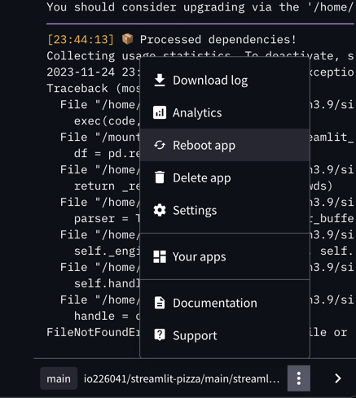
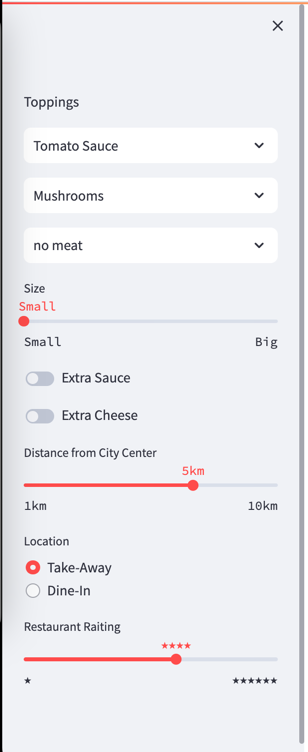
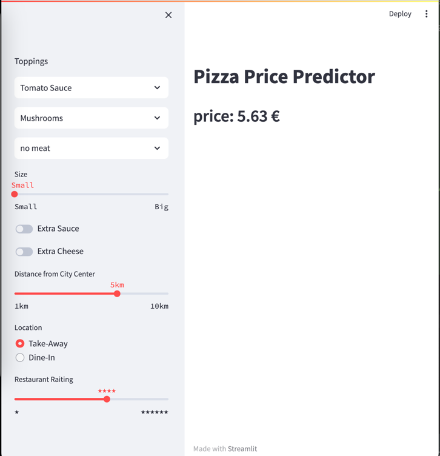
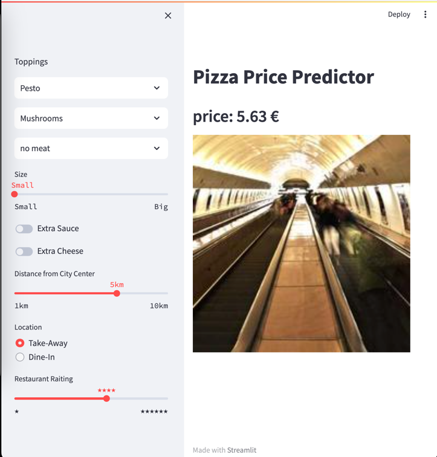
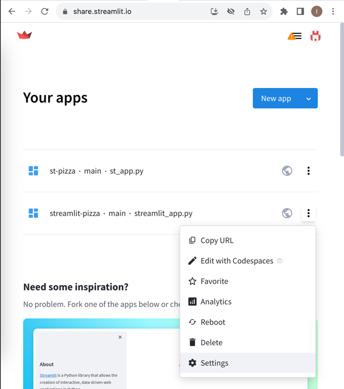
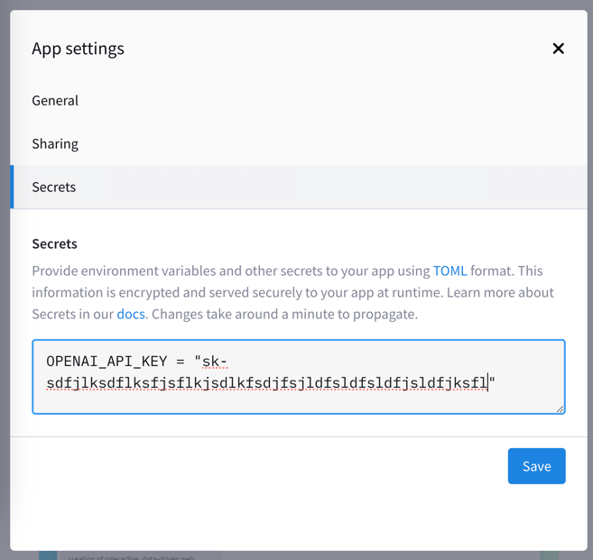
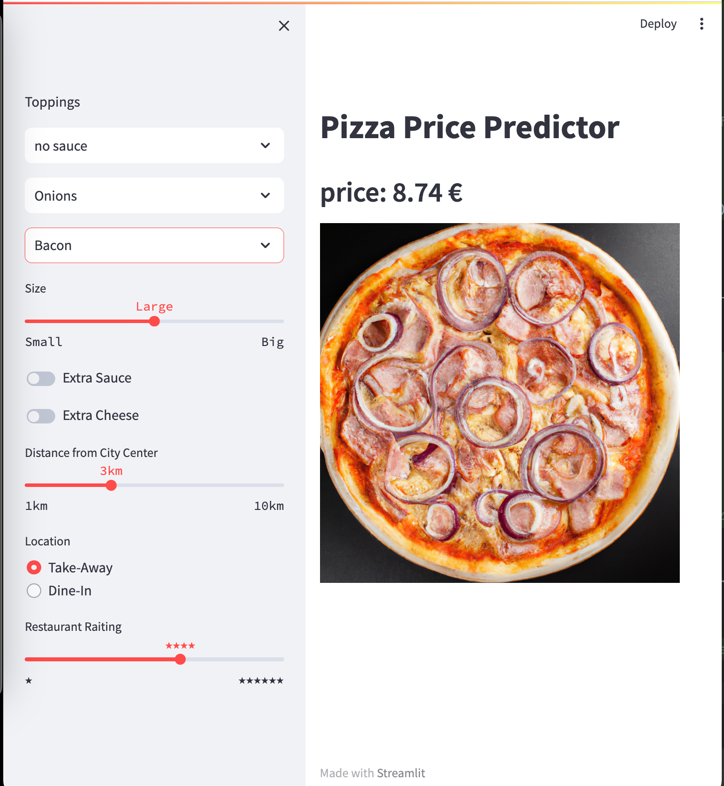
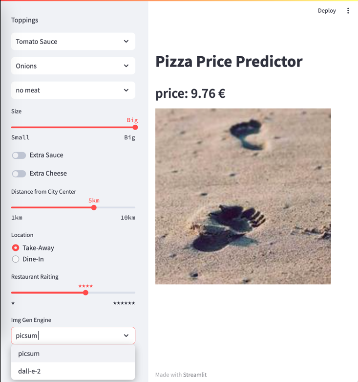

# Tutorial

## Streamlit einrichten

Unter folgendem Link finden Sie eine Einleitung, wie die Streamlit eingerichtet und eine App erstellt und über GitHub eingerichtet werden kann.   
https://youtu.be/HKoOBiAaHGg

Folgen Sie der Anleitung und erstellen Sie ihre eigene App.

## Python Bibliotheken installieren
Damit der Server, auf welchem die Streamlit-App läuft, alle benötigten Bibliotheken installieren kann, muss die Liste dieser Bibliotheken dem App-Projekt hinzugefügt werden. Erstellen Sie dafür eine neue Datei `requirements.txt` neben der `streamlit.py`-Datei mit foldendem Inhalt:
```properties
pandas~=2.1.3
scikit-learn~=1.3.2
statsmodels~=0.14.0
```
Committen Sie die Änderungen.
Damit die in `requirements.txt` angegebenen Python-Bibliotheken auf dem App-Server installiert werden, muss die App neugestartet werden. Neustart kann durch "Manage app" -> "Reboot app" initiiert werden:



## Pizza-Daten Datei einfügen

Für die Erstellung des KI-Modells werden die Test- und Trainings-Daten benötigt.
Legen Sie folgende Datei in Ihr App-Projekt neben der `streamlit.py`-Datei ab: 

[pizza_dataset_relative_price.csv](pizza_dataset_relative_price.csv)

## Model estellen

Mit folgendem Python Code wird das Modell erstellt.
Füllen Sie die `streamlit.py`-Datei mit foldendem Inhalt:

```python
import streamlit as st
import pandas as pd
from sklearn.model_selection import train_test_split
from statsmodels import api as sm

csv_file="pizza_dataset_relative_price.csv"
df = pd.read_csv(csv_file)
Y = df['Relative Price']
X = df.drop(['Relative Price', 'Pizza Name', 'Topping 3_Meat', 'Topping 3_None', 'Topping 4_Fish', 'Topping 4_None',
             'Overall Weight'], axis=1) 
X = sm.add_constant(X)
X_train, X_test, y_train, y_test = train_test_split(X, Y, test_size=0.30, random_state=1)
model = sm.OLS(y_train, X_train).fit()
st.write("model created")
```
Die Zusammenfassung des Modells wird mithilfe von `model.summary()` ausgegeben.
```python
st-write(model.summary())
```

Die Erstellung des Modells wird in eine separate Funktion ausgelagert. Die Auslagerung der Modellerstellung in eine separate Funktion ermöglicht eine verbesserte Code-Struktur, einfachere Wartbarkeit und erhöhte Wiederverwendbarkeit.  
Als Funktionseingabeparameter wird die csv-Datei mit den Daten reingereicht.
```python

import pandas as pd
from sklearn.model_selection import train_test_split
from statsmodels import api as sm

def create_model(csv_file):
    df = pd.read_csv(csv_file)
    Y = df['Relative Price']
    X = df.drop(['Relative Price', 'Pizza Name', 'Topping 3_Meat', 'Topping 3_None', 'Topping 4_Fish', 'Topping 4_None',
                 'Overall Weight'], axis=1) 
    X = sm.add_constant(X)
    X_train, X_test, y_train, y_test = train_test_split(X, Y, test_size=0.30, random_state=1)
    model = sm.OLS(y_train, X_train).fit()
    return model
```
Nun kann die Funktion aufgerufen werden. Hier im Beispiel liegt die csv-Datei im data-Verzeichnis.
Die Zusammenfassung des Modells wird mithilfe von `model.summary()` ausgegeben.

```python
model = create_model(csv_file="pizza_dataset_relative_price.csv")
st.write(model.summary())
```

## Pizzapreis mithilfe des Modells vorhersagen

Nur können wir mit einem Beispiel-Datensatz den Preis einer Pizza vorhersagen. Der Datensatz soll genau die Spalten erhalten, welche im Modell vorhanden sind.
```python
pizza_data_record = {
    'Intercept': 2,                     #
    'Topping 1': 0,                     # 0: no, 1: yes
    'Topping 2': 1,                     # 0: no, 1: yes
    'Topping 3': 0,                     # 0: no, 1: yes
    'Size': 1,                          # 0: Small, 1: Large, 2: Big
    'Extras Sauce': 1,                  # 0: no, 1: yes
    'Extra Cheese': 0,                  # 0: no, 1: yes
    'Distance to City Center (km)': 3,  # 1,3,5,10 km
    'Restaurant': 0,                    # 0: Take-Away, 1: Dine-In
    'Rating': 4                         # 1,2,3,4,5,6 Stars
}

df = pd.DataFrame([pizza_data_record])
st.write(df)
st.write(df.transpose())

predicted_price = model.predict(df)
st.write(f"Predicted Price for the User's Pizza: {predicted_price.values[0]}")
```
Hier wird ebenfalls der predict-Code in eine Funktion ausgelagert.
Als Eingabeparameter bekommt die Funktion den Testdatensatz und das Modell selbst.
```python
def predict_price(pizza_data_record, model):
    df = pd.DataFrame([pizza_data_record])
    print(df)
    print(df.transpose())
    predicted_price = model.predict(df)
    return predicted_price.values[0]


pizza_data_record = {
    'Intercept': 2,                     #
    'Topping 1': 0,                     # 0: no, 1: yes
    'Topping 2': 1,                     # 0: no, 1: yes
    'Topping 3': 0,                     # 0: no, 1: yes
    'Size': 1,                          # 0: Small, 1: Large, 2: Big
    'Extras Sauce': 1,                  # 0: no, 1: yes
    'Extra Cheese': 0,                  # 0: no, 1: yes
    'Distance to City Center (km)': 3,  # 1,3,5,10 km
    'Restaurant': 0,                    # 0: Take-Away, 1: Dine-In
    'Rating': 4                         # 1,2,3,4,5,6 Stars
}

price = predict_price(pizza_data_record, model)
st.write(f"price: {price} €")
```
## Gesamter Code bis jetzt
<details>
  <summary>Klicken zum Aufklappen</summary>

```python
import streamlit as st
import pandas as pd
from sklearn.model_selection import train_test_split
from statsmodels import api as sm


def create_model(csv_file):
    df = pd.read_csv(csv_file)
    Y = df['Relative Price']
    X = df.drop(['Relative Price', 'Pizza Name', 'Topping 3_Meat', 'Topping 3_None', 'Topping 4_Fish', 'Topping 4_None',
                 'Overall Weight'], axis=1)
    X = sm.add_constant(X)
    X_train, X_test, y_train, y_test = train_test_split(X, Y, test_size=0.30, random_state=1)
    model = sm.OLS(y_train, X_train).fit()
    return model


def predict_price(pizza_data_record, model):
    df = pd.DataFrame([pizza_data_record])
    print(df)
    print(df.transpose())
    predicted_price = model.predict(df)
    return predicted_price.values[0]


pizza_data_record = {
    'Intercept': 2,                     #
    'Topping 1': 0,                     # 0: no, 1: yes
    'Topping 2': 1,                     # 0: no, 1: yes
    'Topping 3': 0,                     # 0: no, 1: yes
    'Size': 1,                          # 0: Small, 1: Large, 2: Big
    'Extras Sauce': 1,                  # 0: no, 1: yes
    'Extra Cheese': 0,                  # 0: no, 1: yes
    'Distance to City Center (km)': 3,  # 1,3,5,10 km
    'Restaurant': 0,                    # 0: Take-Away, 1: Dine-In
    'Rating': 4                         # 1,2,3,4,5,6 Stars
}

# create model
model = create_model(csv_file="pizza_dataset_relative_price.csv")
st.write(model.summary())

# predict price
price = predict_price(pizza_data_record, model)
st.write(f"price: {price} €")
```
</details>

## App-Mainframe vorbereiten
Als estes enfernen Sie alle unnötige `st.write()` Aufrufe.
Wählen Sie einen Titel für die App:
```python
st.title("Pizza Price Predictor")
```
Die Ausgabe des Preises kann angepasst werden: Auf zwei Nachkommastellen runden und die Schrift vergrößern:
```python
st.header(f"price: {price:.2f} €")
```

## Dateneingabe über die Sidebar

Estellen Sie nun die Oberflächenelemente in der App, damit ein Test-Record eingegeben werden kann. Für die Eingabe eignet sich die Sidebar. 
```python
st.sidebar.write("Toppings")
topping1 = st.sidebar.selectbox(label=f"#1 - sauce", options=(["no sauce", "Tomato Sauce", "Pesto", "Alfredo"]), label_visibility="collapsed")
topping2 = st.sidebar.selectbox(label=f"#2 - vegetable", options=(["no vegetable", "Pepperoni", "Mushrooms", "Onions", "Tomatoes"]), label_visibility="collapsed")
topping3 = st.sidebar.selectbox(label=f"#3 - meat", options=(["no meat", "Sausage", "Bacon", "Gyros"]), label_visibility="collapsed")
size_labels = {0: "Small", 1: "Large", 2: "Big"}
pizza_size = st.sidebar.select_slider("Size", [0, 1, 2], 1, format_func=lambda x: size_labels[x])
extra_sauce = st.sidebar.toggle("Extra Sauce")
extra_cheese = st.sidebar.toggle("Extra Cheese")
distance = st.sidebar.select_slider("Distance from City Center", [1, 3, 5, 10], 3, format_func=lambda x: f"{x}km")
location_labels = {0: "Take-Away", 1: "Dine-In"}
location_choice = st.sidebar.radio("Location", [0, 1], format_func=lambda x: location_labels[x])
rating = st.sidebar.select_slider("Restaurant Raiting", [1, 2, 3, 4, 5, 6], 4, format_func=lambda x: f"{x * '★'}")
```

Die App soll nun wie folgt im Browser aussehen:



## Aus Eingabedaten einen Daten-Record erzeugen
Im nächsten Schritt sollen alle Eingabedaten aus der Sidedbar einen Pizza-Daten-Record erzeugen.
Fügen Sie folgenden Code ein:

```python
pizza_data_record = {
    'Intercept': 2,                     #
    'Topping 1': int(not topping1.startswith("no")),  # 0: no, 1: yes
    'Topping 2': int(not topping2.startswith("no")),  # 0: no, 1: yes
    'Topping 3': int(not topping3.startswith("no")),  # 0: no, 1: yes
    'Size': pizza_size,                               # 0: Small, 1: Large, 2: Big
    'Extras Sauce': int(extra_sauce),                 # 0: no, 1: yes
    'Extra Cheese': int(extra_cheese),                # 0: no, 1: yes
    'Distance to City Center (km)': distance,         # 1,3,5,10 km
    'Restaurant': location_choice,                    # 0: Take-Away, 1: Dine-In
    'Rating': rating                                  # 1,2,3,4,5,6 Stars
}
```

Damit können nun die Eingabedaten aus der Sidebar zur Berechnung vom Pizza-Preis verwendet werden.
Bei jeder Änderung in der Sidebar wird der Python-Code ausgeführt und damit die Obefläche neu geladen und die Anzeige vom geschätzem Pizza-Preis aktualisiert wird. 

Auch der Sidebar-relevanter Code kann in eine Funktion wandern und als Rückgabewert den Pizza-Daten-Record zurückgeben:

```python

def sidebar():
    st.sidebar.write("Toppings")
    topping1 = st.sidebar.selectbox(label=f"#1 - sauce", options=(["no sauce", "Tomato Sauce", "Pesto", "Alfredo"]), label_visibility="collapsed")
    topping2 = st.sidebar.selectbox(label=f"#2 - vegetable", options=(["no vegetable", "Pepperoni", "Mushrooms", "Onions", "Tomatoes"]), label_visibility="collapsed")
    topping3 = st.sidebar.selectbox(label=f"#3 - meat", options=(["no meat", "Sausage", "Bacon", "Gyros"]), label_visibility="collapsed")
    size_labels = {0: "Small", 1: "Large", 2: "Big"}
    pizza_size = st.sidebar.select_slider("Size", [0, 1, 2], 1, format_func=lambda x: size_labels[x])
    extra_sauce = st.sidebar.toggle("Extra Sauce")
    extra_cheese = st.sidebar.toggle("Extra Cheese")
    distance = st.sidebar.select_slider("Distance from City Center", [1, 3, 5, 10], 3, format_func=lambda x: f"{x}km")
    location_labels = {0: "Take-Away", 1: "Dine-In"}
    location_choice = st.sidebar.radio("Location", [0, 1], format_func=lambda x: location_labels[x])
    rating = st.sidebar.select_slider("Restaurant Raiting", [1, 2, 3, 4, 5, 6], 4, format_func=lambda x: f"{x * '★'}")


    pizza_data_record = {
        'Intercept': 2,                     #
        'Topping 1': int(not topping1.startswith("no")),  # 0: no, 1: yes
        'Topping 2': int(not topping2.startswith("no")),  # 0: no, 1: yes
        'Topping 3': int(not topping3.startswith("no")),  # 0: no, 1: yes
        'Size': pizza_size,                               # 0: Small, 1: Large, 2: Big
        'Extras Sauce': int(extra_sauce),                 # 0: no, 1: yes
        'Extra Cheese': int(extra_cheese),                # 0: no, 1: yes
        'Distance to City Center (km)': distance,         # 1,3,5,10 km
        'Restaurant': location_choice,                    # 0: Take-Away, 1: Dine-In
        'Rating': rating                                  # 1,2,3,4,5,6 Stars
    }
    return pizza_data_record
```
Nun kann der Sidebar-Code aufgerufen werden und das Ergebnis der Funktion, der Daten-Record, kann anschließend an das Modell zur Berechnung des Pizza-Preises übergeben werden:
```python
# load sidebar and get input data
pizza_data_record = sidebar()

# predict price
price = predict_price(pizza_data_record, model)
```

So sieht die App im Browser aus.



## Gesamter Code bis jetzt
<details>
  <summary>Klicken zum Aufklappen</summary>

```python
import streamlit as st
import pandas as pd
from sklearn.model_selection import train_test_split
from statsmodels import api as sm

###################
#    Functions    #
###################

def create_model(csv_file):
    df = pd.read_csv(csv_file)
    Y = df['Relative Price']
    X = df.drop(['Relative Price', 'Pizza Name', 'Topping 3_Meat', 'Topping 3_None', 'Topping 4_Fish', 'Topping 4_None',
                 'Overall Weight'], axis=1)
    X = sm.add_constant(X)
    X_train, X_test, y_train, y_test = train_test_split(X, Y, test_size=0.30, random_state=1)
    model = sm.OLS(y_train, X_train).fit()
    return model


def predict_price(pizza_data_record, model):
    df = pd.DataFrame([pizza_data_record])
    predicted_price = model.predict(df)
    return predicted_price.values[0]


def sidebar():
    st.sidebar.write("Toppings")
    topping1 = st.sidebar.selectbox(label=f"#1 - sauce", options=(["no sauce", "Tomato Sauce", "Pesto", "Alfredo"]), label_visibility="collapsed")
    topping2 = st.sidebar.selectbox(label=f"#2 - vegetable", options=(["no vegetable", "Pepperoni", "Mushrooms", "Onions", "Tomatoes"]), label_visibility="collapsed")
    topping3 = st.sidebar.selectbox(label=f"#3 - meat", options=(["no meat", "Sausage", "Bacon", "Gyros"]), label_visibility="collapsed")
    size_labels = {0: "Small", 1: "Large", 2: "Big"}
    pizza_size = st.sidebar.select_slider("Size", [0, 1, 2], 1, format_func=lambda x: size_labels[x])
    extra_sauce = st.sidebar.toggle("Extra Sauce")
    extra_cheese = st.sidebar.toggle("Extra Cheese")
    distance = st.sidebar.select_slider("Distance from City Center", [1, 3, 5, 10], 3, format_func=lambda x: f"{x}km")
    location_labels = {0: "Take-Away", 1: "Dine-In"}
    location_choice = st.sidebar.radio("Location", [0, 1], format_func=lambda x: location_labels[x])
    rating = st.sidebar.select_slider("Restaurant Raiting", [1, 2, 3, 4, 5, 6], 4, format_func=lambda x: f"{x * '★'}")

    pizza_data_record = {
        'Intercept': 2,                     #
        'Topping 1': int(not topping1.startswith("no")),  # 0: no, 1: yes
        'Topping 2': int(not topping2.startswith("no")),  # 0: no, 1: yes
        'Topping 3': int(not topping3.startswith("no")),  # 0: no, 1: yes
        'Size': pizza_size,                               # 0: Small, 1: Large, 2: Big
        'Extras Sauce': int(extra_sauce),                 # 0: no, 1: yes
        'Extra Cheese': int(extra_cheese),                # 0: no, 1: yes
        'Distance to City Center (km)': distance,         # 1,3,5,10 km
        'Restaurant': location_choice,                    # 0: Take-Away, 1: Dine-In
        'Rating': rating                                  # 1,2,3,4,5,6 Stars
    }
    return pizza_data_record


###################
#    App Start    #
###################

st.title("Pizza Price Predictor")

# create model
model = create_model(csv_file="pizza_dataset_relative_price.csv")

# load sidebar and get input data
pizza_data_record = sidebar()

# predict price
price = predict_price(pizza_data_record, model)
st.header(f"price: {price:.2f} €")
```
</details>


## Bild von der Pizza generieren


Nun soll die App ein Bild für die eingestellte Pizza generieren.

Damit die Topping-Namen nach dem Aufruf von `sidebar()` bekannt sind und nicht "vergessen" werden, soll die Funtion `sidebar()` zusätzlich zu dem Pizza-Daten-Record die Toppings-Namen zurückgeben.
Erweitern Sie den Rückgabewert der Funktion und den Array mit den Toppings-Namen:
```python
# generate pizza image
def sidebar():
    ...
    return pizza_data_record, [topping1, topping2, topping3]
```
Der Aufruf der `sidebar()` Funktion soll wie folgt erweitert werden:
```python
pizza_data_record, toppings = sidebar()
```
 
Für die Generierung der Bilder estellen wir eine Funktion, welche das Bild generiert und die URL für das generierte Bild zurückgibt.
Als Eingabe bekommt die Funktion alle  Toppings. Zusätzlich soll die Funktion verschiedene Engines für die Bildgenerierung nutzen können.
```python
def generate_pizza_image(toppings, img_gen_model):
    img_path = ...
    return img_path
```
Für den ersten Prototypen kann der Service von https://picsum.photos genutzt werden, welcher zufälligen Bilder liefert. Wir nennen das Engine "picsum".
Fügen sie folgenden Code ein:
```python
def generate_pizza_image(toppings, img_gen_model):
    if img_gen_model == 'picsum':
        seed = "-".join(toppings)
        return f"https://picsum.photos/seed/{seed}/200" 
    return ""
```

Nun kann das Bild generiert und in die App eingefügt werden.
```python
# load sidebar and get input data
pizza_data_record, toppings = sidebar()

# generate pizza image
st.image(generate_pizza_image(toppings, img_gen_model="picsum"), width=400)
``` 
So sieht die App im Browser aus.




## Gesamter Code bis jetzt
<details>
  <summary>Klicken zum Aufklappen</summary>

```python
import streamlit as st
import pandas as pd
from sklearn.model_selection import train_test_split
from statsmodels import api as sm


def create_model(csv_file):
    df = pd.read_csv(csv_file)
    Y = df['Relative Price']
    X = df.drop(['Relative Price', 'Pizza Name', 'Topping 3_Meat', 'Topping 3_None', 'Topping 4_Fish', 'Topping 4_None',
                 'Overall Weight'], axis=1)
    X = sm.add_constant(X)
    X_train, X_test, y_train, y_test = train_test_split(X, Y, test_size=0.30, random_state=1)
    model = sm.OLS(y_train, X_train).fit()
    return model


def predict_price(pizza_data_record, model):
    df = pd.DataFrame([pizza_data_record])
    predicted_price = model.predict(df)
    return predicted_price.values[0]


def sidebar():
    st.sidebar.write("Toppings")
    topping1 = st.sidebar.selectbox(label=f"#1 - sauce", options=(["no sauce", "Tomato Sauce", "Pesto", "Alfredo"]), label_visibility="collapsed")
    topping2 = st.sidebar.selectbox(label=f"#2 - vegetable", options=(["no vegetable", "Pepperoni", "Mushrooms", "Onions", "Tomatoes"]), label_visibility="collapsed")
    topping3 = st.sidebar.selectbox(label=f"#3 - meat", options=(["no meat", "Sausage", "Bacon", "Gyros"]), label_visibility="collapsed")
    size_labels = {0: "Small", 1: "Large", 2: "Big"}
    pizza_size = st.sidebar.select_slider("Size", [0, 1, 2], 1, format_func=lambda x: size_labels[x])
    extra_sauce = st.sidebar.toggle("Extra Sauce")
    extra_cheese = st.sidebar.toggle("Extra Cheese")
    distance = st.sidebar.select_slider("Distance from City Center", [1, 3, 5, 10], 3, format_func=lambda x: f"{x}km")
    location_labels = {0: "Take-Away", 1: "Dine-In"}
    location_choice = st.sidebar.radio("Location", [0, 1], format_func=lambda x: location_labels[x])
    rating = st.sidebar.select_slider("Restaurant Raiting", [1, 2, 3, 4, 5, 6], 4, format_func=lambda x: f"{x * '★'}")

    pizza_data_record = {
        'Intercept': 2,                     #
        'Topping 1': int(not topping1.startswith("no")),  # 0: no, 1: yes
        'Topping 2': int(not topping2.startswith("no")),  # 0: no, 1: yes
        'Topping 3': int(not topping3.startswith("no")),  # 0: no, 1: yes
        'Size': pizza_size,                               # 0: Small, 1: Large, 2: Big
        'Extras Sauce': int(extra_sauce),                 # 0: no, 1: yes
        'Extra Cheese': int(extra_cheese),                # 0: no, 1: yes
        'Distance to City Center (km)': distance,         # 1,3,5,10 km
        'Restaurant': location_choice,                    # 0: Take-Away, 1: Dine-In
        'Rating': rating                                  # 1,2,3,4,5,6 Stars
    }
    return pizza_data_record, [topping1, topping2, topping3]


def generate_pizza_image(toppings, img_gen_model):
    if img_gen_model == 'picsum':
        seed = "-".join(map(str, toppings))
        return f"https://picsum.photos/seed/{seed}/200"
    return ""


###################
#    App Start    #
###################

st.title("Pizza Price Predictor")

# create model
model = create_model(csv_file="pizza_dataset_relative_price.csv")

# load sidebar and get input data
pizza_data_record, toppings = sidebar()

# predict price
price = predict_price(pizza_data_record, model)
st.header(f"price: {price:.2f} €")

# generate pizza image
st.image(generate_pizza_image(toppings, img_gen_model="picsum"), width=400)
```
</details>

## OpenAI API Anbindung einrichten
Damit die Generierung von Pizza-Bilder mithilfe von OpenAI stattfinden kann, muss der OpenAI API-Key der App zur Verfügung gestellt werden.

Registrieren Sie sich und generieren Sie einen API-Key unter https://platform.openai.com/api-keys

Da der App-Code in der Cloud und ggf. öffentlich verfügbar ist, sollte der private OpenAI-Key nicht im Source-Code veröffentlicht werden.

Speichern Sie den Key im Secret-Bereich unter App-Settings auf der Streamlit-Plattform:





Damit der OpenAI-Client Code den Key zur Laufzeit nutzen kann, muss der Key aus der secret-Datei in die Laufzeitumgebung geladen werden.
Fügen Sie folgenden Code ein:
```python
import os

os.environ['OPENAI_API_KEY'] = st.secrets['OPENAI_API_KEY']
```
Zusätzlich muss die `openai` Python-Bibliothek installiert werden. Fügen Sie folgenden Eintrag in die Datei `requirements.txt` ein:
```properties
openai~=1.3.5
```

## Pizza-Bilder mit OpenAI generieren
OpenAI bietet diverse Bildgenerierungs-Engine, z. B. DALL-E: https://platform.openai.com/docs/models/dall-e
DIe Preise können hier nachvollzogen werden: https://openai.com/pricing

Für die Bildergenerierung mit DALL-E fügen Sie folgende Funktion ein:
```python
from openai import OpenAI

def dalle_request(prompt, img_gen_model, img_size):
    try:
        client = OpenAI()
        response = client.images.generate(
            model=img_gen_model,
            prompt=prompt,
            size=img_size,
            quality="standard",
            n=1,
        )
        # response.raise_for_status()  # Raise an error for bad responses (e.g., 4xx, 5xx)
        return response.data[0].url
    except Exception as e:
        st.error(f"Error making DALL-E API request: {e}")
        return ""
```

Nun kann der DALL-E Engine für die Generierung der Pizza-Bilder genutzt werden. Erweitern Sie die Funktion `generate_pizza_image()` wie folgt:
```python
def generate_pizza_image(toppings, img_gen_model):
    if img_gen_model == 'picsum':
        seed = "-".join(toppings)
        return f"https://picsum.photos/seed/{seed}/200"
    if img_gen_model == 'dall-e-2':
        prompt = f"One round pizza on a black table with toppings: {', '.join(toppings)}"
        return dalle_request(prompt, img_gen_model, "1024x1024")
    return ""
```
Damit kann die Bildgenerator-Funktion mit den neuen Enging `dall-e-2` aufgerufen werden:
<div style="background-color: #f8d7da; color: #721c24; border: 1px solid #f5c6cb; border-radius: 0.25rem; padding: 1rem; margin-bottom: 1rem;">
    <b>Vorsicht:</b> Die Nutzung von DALL-E Modell verursacht Kosten.
</div>

```python
st.image(generate_pizza_image(toppings, img_gen_model="dall-e-2"), width=400)
```

Nun sieht die App so aus:



## Bild-Generator Engine zur Laufzeit ändern

Damit das Engine zur Laufzeit angepasst werden kann, erweitern Sie die `sidebar()` Funktion wie folgt:
```python
def sidebar():
    ...
    img_gen_engine = st.sidebar.selectbox(label=f"Img Gen Engine", options=(["picsum", "del-e-2"]))
    return pizza_data_record, [topping1, topping2, topping3], img_gen_engine
```

Nun kann das Img-Gen-Engine zur Laufzeit geändert werden:


